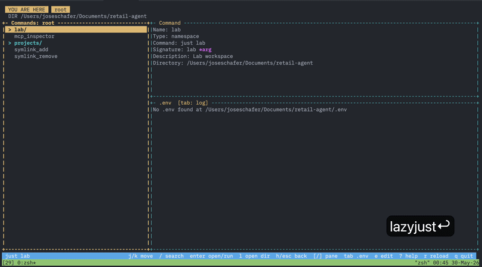

# lazyjust

Lazy-style terminal UI for navigating monorepo `justfile` commands.



The interface follows a lazygit-style pane layout:

- left pane: just recipes
- top-right pane: selected command details
- bottom-right pane: command log and help
- bottom bar: current path and keybindings

## Installation

### From GitHub

```bash
uv tool install git+https://github.com/Jose-Schafer/lazyjust.git
```

### From local clone

```bash
uv tool install /path/to/lazyjust
```

After local changes, reinstall:

```bash
uv tool install --reinstall /path/to/lazyjust
```

## Usage

Run from any project root with a justfile:

```bash
lazyjust
```

Or during development:

```bash
just run
```

Controls:

- `j` / `k` or arrow keys: navigate
- `/`: search commands across nested justfiles
- `enter`: open a variadic delegation recipe or run a recipe
- `l`: open a variadic delegation recipe only; never runs commands
- `[` / `]`: move focus between panes
- `tab`: switch the lower pane between logs and the current level `.env`
- `e`: open the current level `justfile` in Zed
- `?`: show context-aware keybinding hints
- `h` / `esc` / `backspace`: go up
- `r`: reload
- `q`: quit

Recipes with variadic arguments, such as `@projects *args`, are treated as folders.
Opening one runs `just projects --list`, so delegated service justfiles can be browsed.

## Expected Justfile Structure

lazyjust navigates justfiles in nested directories:

```
repo/
├── justfile              # Root justfile with namespaces
├── .env                  # Root environment vars
├── services/
│   ├── api/
│   │   ├── justfile      # API-specific recipes
│   │   └── .env          # API environment vars
│   └── web/
│       ├── justfile      # Web-specific recipes
│       └── .env          # Web environment vars
└── tools/
    └── docker/
        └── justfile      # Docker recipes
```

**Root justfile** delegates to nested justfiles:
```just
set dotenv-load := true

[working-directory: "services/api"]
@api *args:
    just {{ args }}

[working-directory: "services/web"]
@web *args:
    just {{ args }}
```

**Nested justfile** (`services/api/justfile`) has local recipes:
```just
set dotenv-load := true

dev: # Start dev server
    cargo run

test: # Run tests
    cargo test
```

Key requirements:
- Variadic recipes (`*args`) with `[working-directory]` create navigable namespaces
- Each namespace points to a directory with its own `justfile`
- Recipe descriptions (`# comment`) appear in detail pane
- `set dotenv-load := true` enables `.env` viewing with tab key

## Configuration: `.lazyjust.json`

Create `.lazyjust.json` in your project root to define argument presets for recipes with parameters:

```json
{
  "_comment": [
    "Command paths use '/' separator (e.g., 'api/deploy')",
    "Single-arg/variadic: input passed as-is",
    "Multi-arg: input split by shell quoting rules"
  ],
  "options": {
    "api/deploy": [
      "staging",
      "production"
    ],
    "services/web/build": [
      "dev",
      "production --minify"
    ]
  }
}
```

When you run a recipe with arguments, lazyjust shows a selection menu with presets if configured. Press `i` to enter custom input instead.

On first run, lazyjust prompts to create a template config file with examples.

## Claude Code Skill

A comprehensive skill for configuring justfiles compatible with lazyjust is available at `skills/justfile-config/skill.md`.

Use it in Claude Code to:
- Set up delegation patterns with `[working-directory]` attributes
- Configure variadic recipes as navigable namespaces
- Structure monorepo justfile hierarchies
- Avoid common anti-patterns

The skill includes examples, best practices, and debugging tips for optimal lazyjust integration.
